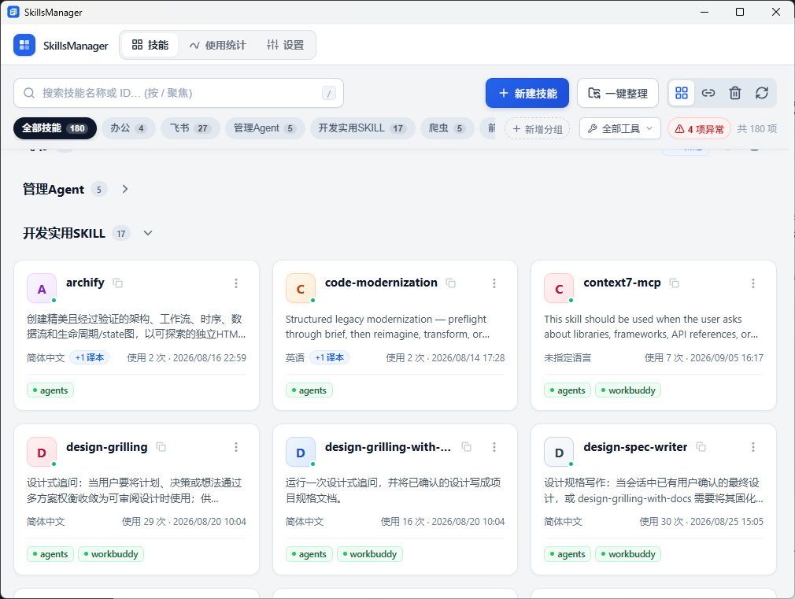
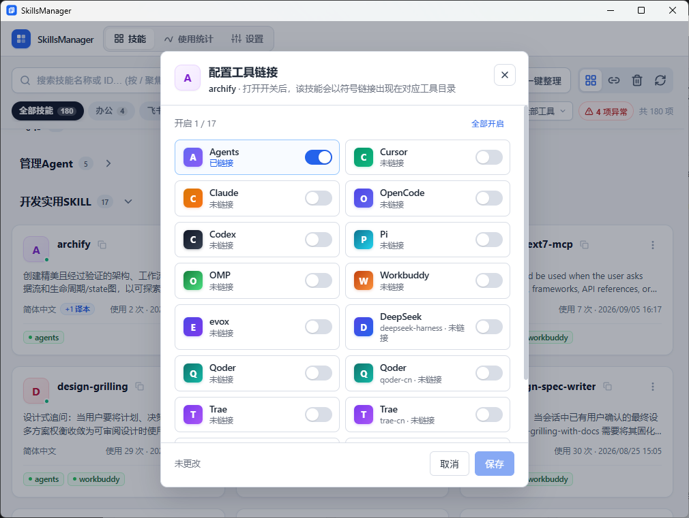
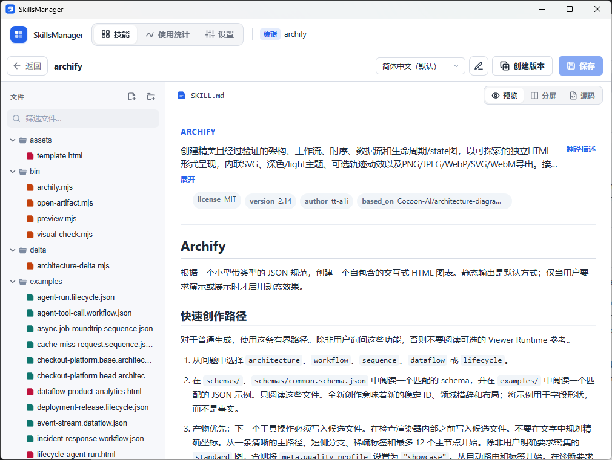
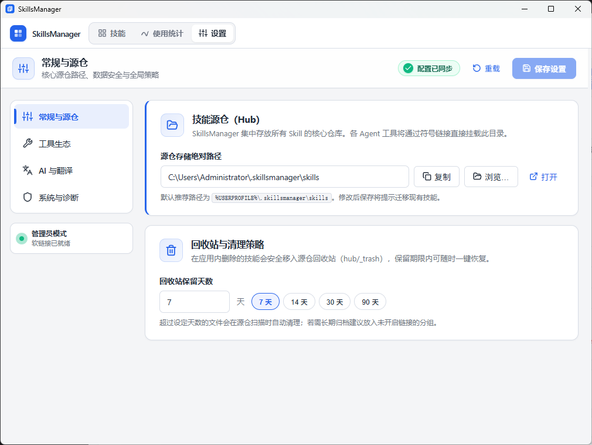

# SkillsManager

**文档语言：** 中文 · [English](README.en.md)

    

把散落在各个 AI 编程工具里的 Skills 收拢到一处。编辑、翻译、统计、整理，一份源仓，各处共用。

Cursor、Claude Code、Codex、OpenCode 等工具各自维护一套 skills 目录，同一份技能常常被复制多份，改一处漏一处。SkillsManager 在本机保管**唯一一份**技能正文，再让各工具通过链接去读它——你改的永远是同一份。同一技能可以生成多语言版本并随时切换；装上可选的 Agent hook 后，还能看到各技能被读取或调用的次数与趋势。

目前提供 **Windows** 安装包。整理技能、挂上或撤下链接时，需要管理员权限，或已开启 Windows「开发人员模式」。

## 界面预览

<table>
  <tr>
    <td align="center" valign="top" width="50%">
       
      系统首页
    </td>
    <td align="center" valign="top" width="50%">
       
      启用 skill
    </td>
  </tr>
  <tr>
    <td align="center" valign="top" width="50%">
       
      skill 详情
    </td>
    <td align="center" valign="top" width="50%">
       
      一键整理
    </td>
  </tr>
  <tr>
    <td align="center" valign="top" width="50%">
       
      使用统计
    </td>
    <td align="center" valign="top" width="50%">
       
      系统设置
    </td>
  </tr>
</table>

## 功能

- **一份技能，处处生效**：所有技能集中保存在本机源仓。你在应用里改一处，已对接的工具立刻读到同一份，不用再复制粘贴、改漏某一边。
- **对接你正在用的工具**：开箱支持 Cursor、Claude Code、Codex、OpenCode、Trae、Qoder 等常见 skills 目录，也可以把任意工作目录加进来一起管。
- **把散落副本收成一套**：先预览再执行：把各工具里的副本迁入源仓并换成链接。两边都改过的可以合并，断掉的链接可以修好。
- **按工具随时挂上或撤下**：给某个工具批量启用或禁用技能，源仓里的文件始终保留；禁用前的状态可以一键恢复。
- **按自己的方式整理清单**：技能多了可以自建分组，在平铺与分组布局间切换。分组只影响本应用里怎么看，各工具仍按技能名称引用。
- **在应用里直接改技能**：搜索、打开、编辑 `SKILL.md` 和技能目录里的其它文件。Markdown 预览支持公式和图表。
- **导入导出，方便迁移与分享**：拖入文件夹、zip 或 `.skill` 包即可导入；也可以按工具把已挂上的技能导出成 zip。
- **同一技能的多语言版本**：生成翻译副本并随时切换；也可以只试译描述、不改原文件。默认可用微软翻译，也可改用 Azure 或 OpenAI 兼容接口。
- **看清哪些技能真正在用**：安装可选的 Agent hook 后，统计各技能被读取或斜杠调用的次数与趋势。
- **误删也能找回**：删除的技能进入回收站，在保留期内随时恢复。

## 安装

1. 从 [Releases](https://github.com/Homchen/SkillsManager/releases) 下载 Windows 安装包（`SkillsManager-*-installer.exe`）。
2. 运行安装向导。安装包**尚未代码签名**，若 Windows SmartScreen 提示，选择「仍要运行」。
3. 首次启动若询问管理员权限：同意后才能整理技能、创建链接；取消则不会进入主界面。

需要统计使用情况时，在向导里勾选 Cursor / Claude Code / Codex / OpenCode（本机需已安装 Node.js）。错过了也可以之后在安装目录运行 `hooks\install.ps1 -Agent cursor` 补装。

## 开始使用

1. 打开 **设置**，确认源仓路径（默认 `%USERPROFILE%\.skillsmanager\skills`），并打开你要管理的工具目录。
2. 到 **技能** 页点 **一键整理**：先看预览，有冲突再决定保留哪一侧或手动合并，然后执行。
3. 用 **按工具批量启用 / 禁用**，把技能挂到需要的工具上。
4. 技能多了，切换到 **分组布局**，建组并把技能归进去。
5. 单击技能进入编辑器，改正文或补充脚本、参考文件。各工具读到的都是源仓里的同一份。
6. 若安装时勾选了 hook，可在 **使用统计** 里查看各技能被调用的次数和趋势。

只想从某个工具撤下技能、又不删源仓：对该工具执行「禁用全部」。

## 许可证

[MIT](LICENSE)。作者：[homchen](https://github.com/Homchen)。

从源码构建或参与开发，见 [贡献指南](CONTRIBUTING.md)。安全漏洞请按 [安全说明](SECURITY.md) 私下报告。为自己的 Agent 写使用统计 hook：见 [Hooks 扩展](docs/hooks-extension.md)。
